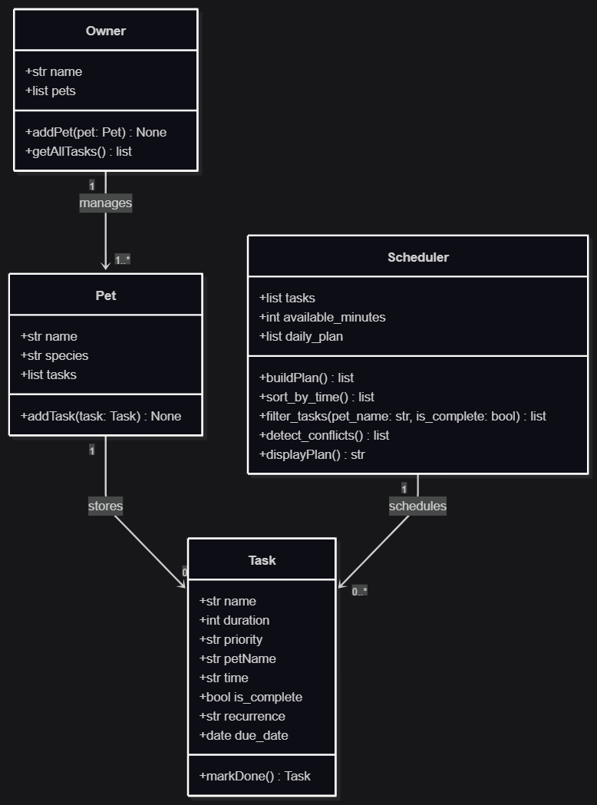

# PawPal+ (Module 2 Project)

You are building **PawPal+**, a Streamlit app that helps a pet owner plan care tasks for their pet.

## Scenario

A busy pet owner needs help staying consistent with pet care. They want an assistant that can:

- Track pet care tasks (walks, feeding, meds, enrichment, grooming, etc.)
- Consider constraints (time available, priority, owner preferences)
- Produce a daily plan and explain why it chose that plan

Your job is to design the system first (UML), then implement the logic in Python, then connect it to the Streamlit UI.

## What you will build

Your final app should:

- Let a user enter basic owner + pet info
- Let a user add/edit tasks (duration + priority at minimum)
- Generate a daily schedule/plan based on constraints and priorities
- Display the plan clearly (and ideally explain the reasoning)
- Include tests for the most important scheduling behaviors

## ✨ Features

- **Task, Pet, and Owner modeling** — tasks belong to a `Pet`; an `Owner` can hold multiple pets and aggregates every pet's tasks into one list via `getAllTasks()`.
- **Weighted-priority schedule building** — `Scheduler.buildPlan()` ranks tasks with `compute_priority_score()`, a weighted score combining priority tier (`PRIORITY_ORDER` × `PRIORITY_WEIGHT`) and due-date urgency (`URGENCY_WEIGHT`, capped at `URGENCY_CAP_DAYS`), then greedily fills the available time budget in that order, skipping any task that would push the plan over the limit.
- **Chronological sorting** — `Scheduler.sort_by_time()` reorders tasks by their `"HH:MM"` start time; exposed in the UI as a "Sort by start time" toggle.
- **Pet and status filtering** — `Scheduler.filter_tasks(pet_name, is_complete)` narrows the task list by pet name and/or completion status (either filter can be applied independently); the UI exposes both as dropdown controls.
- **Overlap/conflict detection** — `Scheduler.detect_conflicts()` sorts tasks by `(due_date, time)` and flags any two tasks — same pet or different pets — whose time windows overlap on the same day, returning human-readable warning strings; the UI renders each as an `st.warning`, or an `st.success` confirmation when the day is conflict-free.
- **Recurring tasks** — `Task.markDone()` marks a task complete and, when its `recurrence` is `"daily"` or `"weekly"`, automatically returns a new `Task` for the next occurrence with `due_date` advanced via `timedelta`.
- **Interactive Streamlit UI** (`app.py`) — add pets/tasks with instant `st.success` confirmations, mark tasks complete (auto-scheduling the next recurrence), filter/sort/view tasks with live `st.metric` summaries (total/pending/completed) and color-coded priority badges, and generate a time-boxed daily schedule as a table with any unscheduled tasks listed separately.

## Mermaid.js Structure


## Getting started

### Setup

```bash
python -m venv .venv
source .venv/bin/activate  # Windows: .venv\Scripts\activate
pip install -r requirements.txt
```

### Suggested workflow

1. Read the scenario carefully and identify requirements and edge cases.
2. Draft a UML diagram (classes, attributes, methods, relationships).
3. Convert UML into Python class stubs (no logic yet).
4. Implement scheduling logic in small increments.
5. Add tests to verify key behaviors.
6. Connect your logic to the Streamlit UI in `app.py`.
7. Refine UML so it matches what you actually built.

## 🖥️ Sample Output

Paste a sample of your app's CLI or Streamlit output here so a reader can see what a generated plan looks like:

```
# e.g.:
# Daily plan for Biscuit (Golden Retriever):
#   08:00 — Morning walk (30 min) [priority: high]
#   09:00 — Feeding (10 min) [priority: high]
#   ...
```

## 🧪 Testing PawPal+

```bash
# Run the full test suite:
python -m pytest

# Run with coverage:
pytest --cov
```

Sample test output:

```
# Paste your pytest output here
rootdir: C:\Users\andyt\Desktop\VSCODE\AI110\projects\ai110-module2show-pawpal-starter
configfile: pytest.ini
plugins: anyio-4.14.1
collected 36 items                                                                                                                                                               

tests\test_pawpal.py ....................................                                                                                                                  [100%]

============================================================================== 36 passed in 0.50s ===============================================================================
```

Confidence Level: 5 stars

## 📐 Smarter Scheduling

| Feature | Method(s) | Notes |
|---------|-----------|-------|
| Time-based sorting | `Scheduler.sort_by_time()` | Sorts tasks chronologically by their `"HH:MM"` start time. |
| Pet/status filtering | `Scheduler.filter_tasks(pet_name, is_complete)` | Returns tasks matching an optional pet name and/or completion status; either filter can be omitted. |
| Conflict detection | `Scheduler.detect_conflicts()` | Sorts tasks by `(due_date, time)` and flags any two tasks — same pet or different pets — whose time windows overlap on the same day. Returns a list of warning strings (empty if none). |
| Recurring tasks | `Task.markDone()` | Marks a task complete, and if its `recurrence` is `"daily"` or `"weekly"`, automatically returns a new `Task` for the next occurrence with `due_date` advanced via `timedelta`. |
| Weighted prioritization | `Scheduler.compute_priority_score(task, today)` / `buildPlan()` | Scores each task by priority tier plus due-date urgency instead of raw list order, then greedily fills the time budget highest-score-first — surfaced in the UI as a `score` column so the plan explains itself. |

## 📸 Demo Walkthrough

Describe your app in numbered steps so a reader can follow along without watching a video:

The main UI features and actions a user can perform is adding pets, adding tasks for different pets, building a schedule, filtering tasks, completing tasks, and viewing already completed tasks

1. Add a pet (describe their name and species)
2. Give that pet a task (task name, duration ,priority, etc) or create another pet. It will show conflict warnings if times conflict
3. Build the schedule with the amounts of available minutes 
4. Mark a task as complete (may create another one depending on if it's reoccuring)
5. Sort the tasks by which ever way you want or continue creating more tasks + pets!

### Input from main.py showing CLI output
```text
-----Today's Schedule-----
Tasks for Cassie
  14:30 to 15:20 — Walk [priority: high]
Tasks for Bob
  16:00 to 16:30 — Vet Checkup [priority: high]
Tasks for Cassie
  12:00 to 12:10 — Feed [priority: medium]
Tasks for Bob
  09:15 to 09:55 — Cut Hair [priority: medium]
  14:35 to 14:55 — Ear Cleaning [priority: medium]
Tasks for Cassie
  08:00 to 08:25 — Bath [priority: low]
  14:40 to 14:55 — Nail Trim [priority: low]

-----Tasks Sorted by Time-----
  08:00 - Bath (Cassie)
  09:15 - Cut Hair (Bob)
  12:00 - Feed (Cassie)
  14:30 - Walk (Cassie)
  14:35 - Ear Cleaning (Bob)
  14:40 - Nail Trim (Cassie)
  16:00 - Vet Checkup (Bob)

-----Incomplete Tasks-----
  Feed (Cassie) - 12:00
  Walk (Cassie) - 14:30
  Ear Cleaning (Bob) - 14:35
  Nail Trim (Cassie) - 14:40
  Vet Checkup (Bob) - 16:00

-----Cassie's Tasks-----
  Bath - 08:00 [done]
  Feed - 12:00 [pending]
  Walk - 14:30 [pending]
  Nail Trim - 14:40 [pending]

-----Schedule Conflicts-----
  Conflict: 'Walk' (Cassie, 14:30-15:20) overlaps with 'Ear Cleaning' (Bob, 14:35)
  Conflict: 'Walk' (Cassie, 14:30-15:20) overlaps with 'Nail Trim' (Cassie, 14:40)
  Conflict: 'Ear Cleaning' (Bob, 14:35-14:55) overlaps with 'Nail Trim' (Cassie, 14:40)

-----Weighted Priority Scores-----
  Walk (Cassie) [priority: high, due: 2026-07-02] -> score 44
  Vet Checkup (Bob) [priority: high, due: 2026-07-02] -> score 44
  Cut Hair (Bob) [priority: medium, due: 2026-07-02] -> score 34
  Feed (Cassie) [priority: medium, due: 2026-07-02] -> score 34
  Ear Cleaning (Bob) [priority: medium, due: 2026-07-02] -> score 34
  Bath (Cassie) [priority: low, due: 2026-07-02] -> score 24
  Nail Trim (Cassie) [priority: low, due: 2026-07-02] -> score 24
```

Note: `buildPlan()` now ranks tasks by weighted priority score before filling the time budget, so `displayPlan()`'s output is grouped by score tier (high → medium → low) rather than the original insertion order — the `due` dates above will shift to match whatever day you actually run this on, since `Task.due_date` defaults to `date.today()`.

**Screenshot or video** *(optional)*: <!-- Insert a screenshot or link to a demo video here -->
